## Задача 1

1. Возьмите код:
 - из ДЗ к лекции 4,
 - из демо к лекции 4.

2. Проверьте код с помощью tflint и checkov. Вам не нужно инициализировать этот проект.

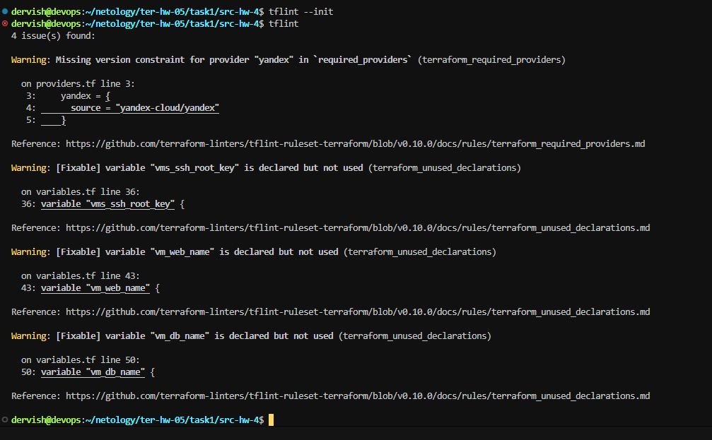
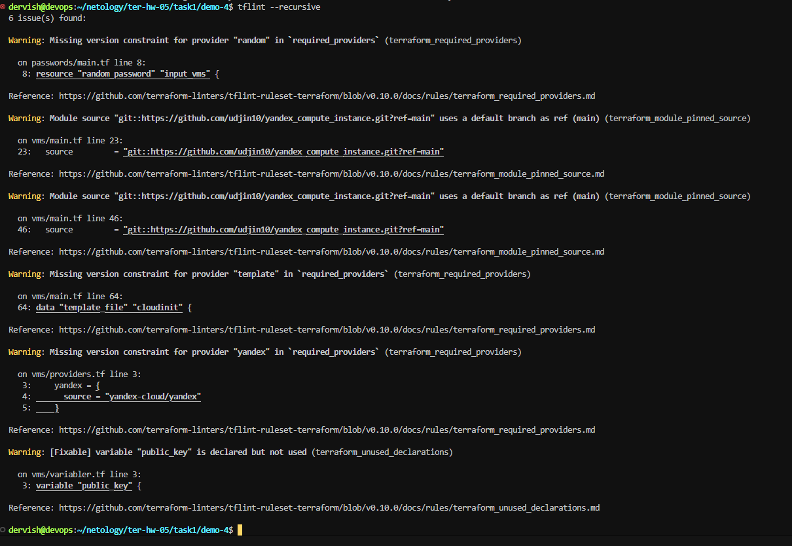
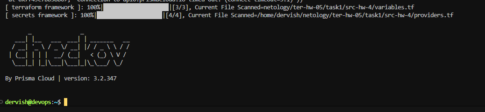
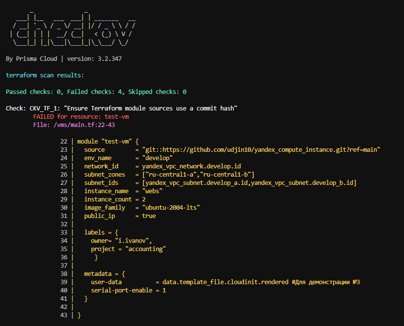

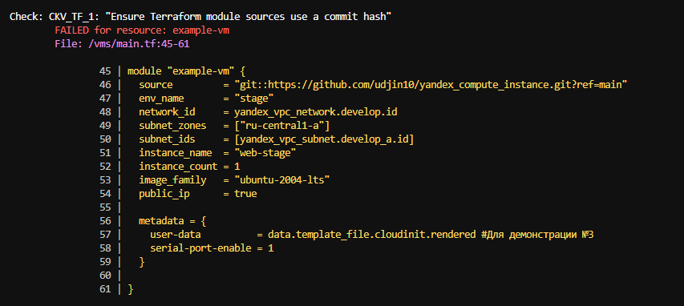
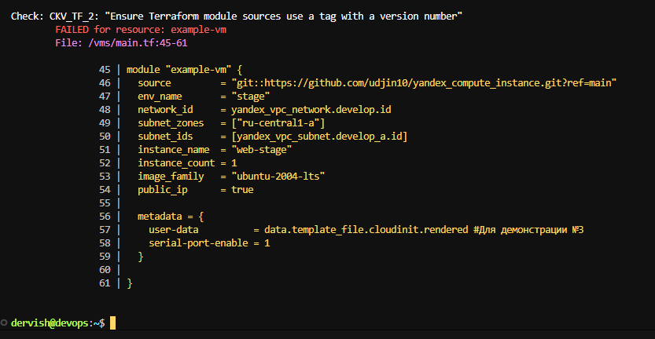

3. Перечислите, какие типы ошибок обнаружены в проекте (без дублей).

>Ответ: не указаны ограничения по версиям при объявлении провайдеров, объявлены не используемые переменные, в объявлении модулей указаны ссылки на git-репозитории без указания конкретного коммита

## Задача 2

1. Возьмите ваш GitHub-репозиторий с выполненным ДЗ 4 в ветке 'terraform-04' и сделайте из него ветку ['terraform-05'](https://github.com/ua4wne/ter-hw-04/tree/terraform-05).

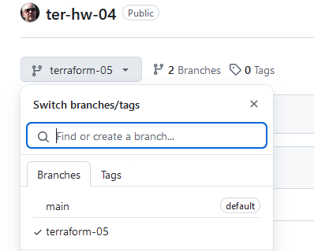
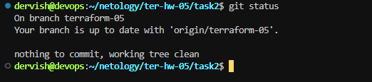

2. Повторите демонстрацию лекции: настройте YDB, S3 bucket, yandex service account, права доступа и мигрируйте state проекта в S3 с блокировками. Предоставьте скриншоты процесса в качестве ответа.

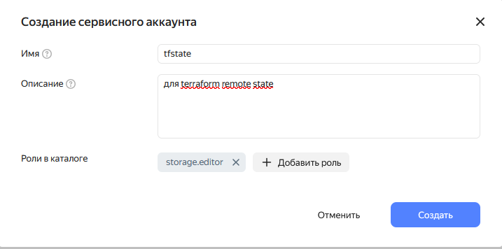

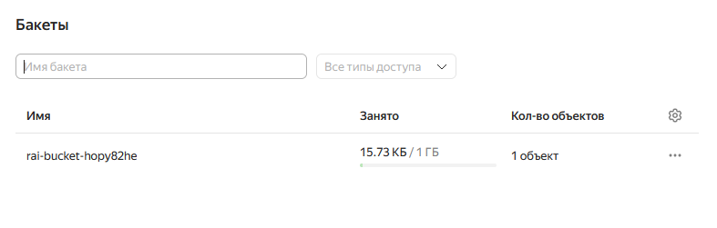
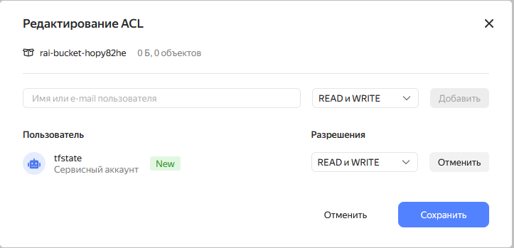
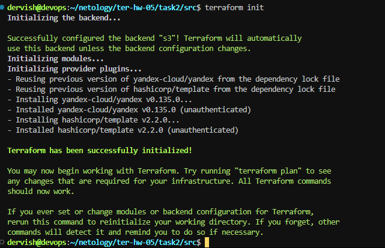

>Выполним команду terraform apply, видим, что файл terraform.tfstate появился в нашем бакете S3

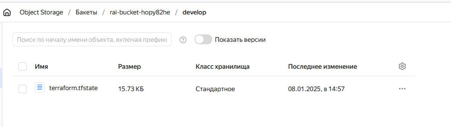

> Настраиваем YDB

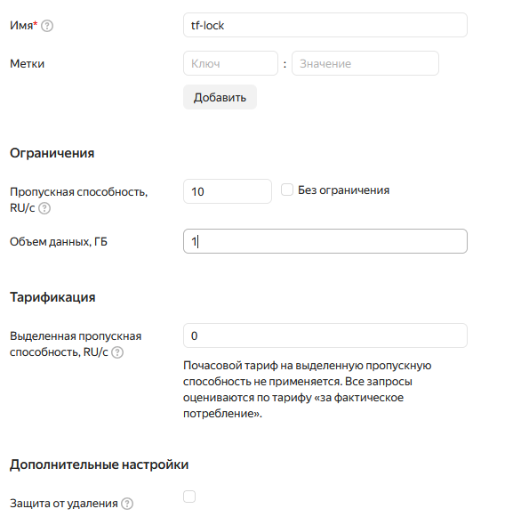
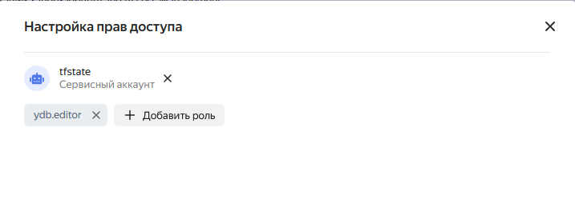
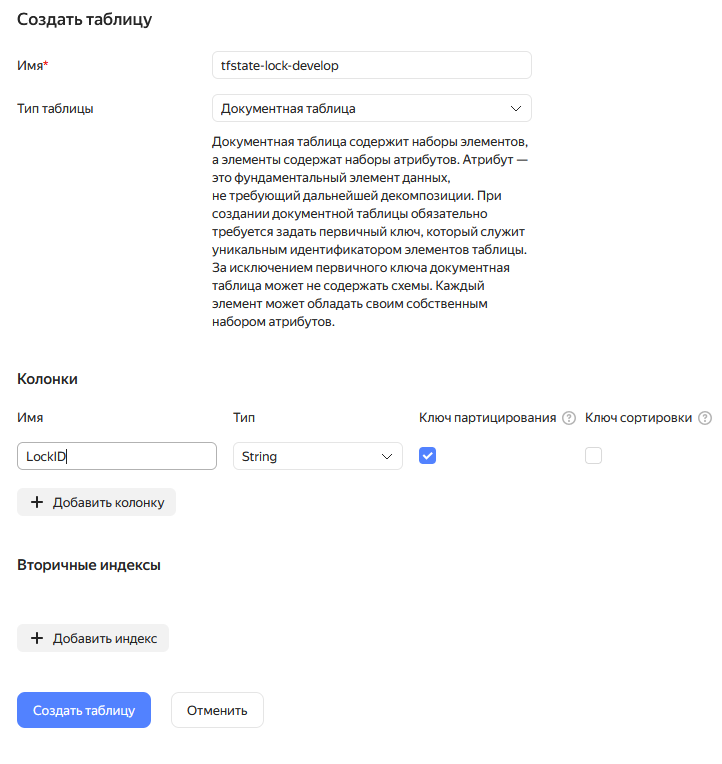

3. Закоммитьте в ветку 'terraform-05' все изменения.
4. Откройте в проекте terraform console, а в другом окне из этой же директории попробуйте запустить terraform apply.

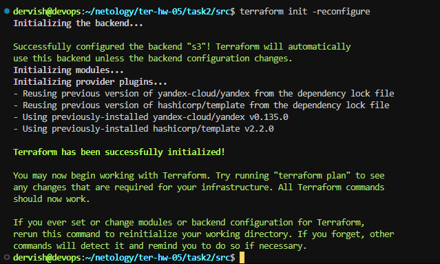
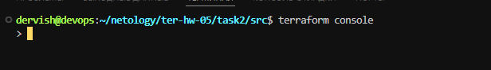
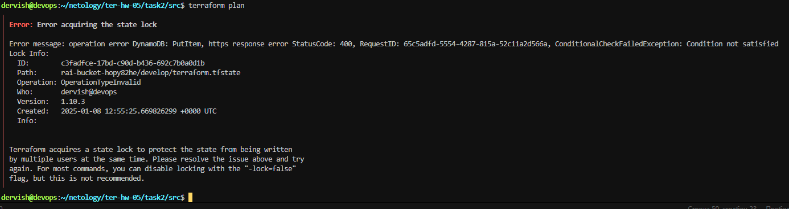

5. Пришлите ответ об ошибке доступа к state.

>Error message: operation error DynamoDB: PutItem, https response error StatusCode: 400, RequestID: bfab7804-4815-43d5-bd7f-1fef87b38c4d, ConditionalCheckFailedException: Condition not satisfied

6. Принудительно разблокируйте state. Пришлите команду и вывод.

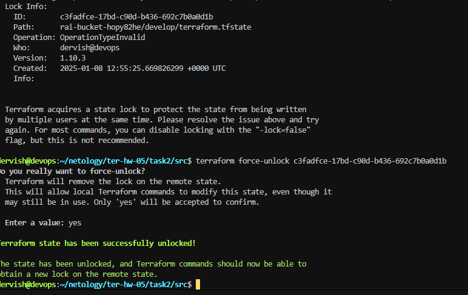

## Задача 3

1. Сделайте в GitHub из ветки 'terraform-05' новую ветку 'terraform-hotfix'.

