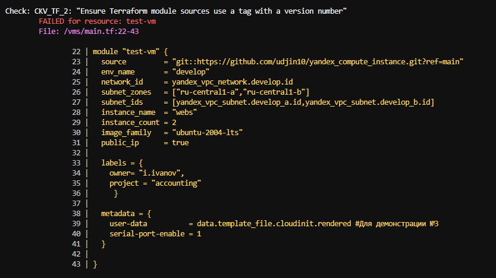

## Задача 1

1. ВВозьмите код:
 - из ДЗ к лекции 4,
 - из демо к лекции 4.

2. Проверьте код с помощью tflint и checkov. Вам не нужно инициализировать этот проект.

3. Перечислите, какие типы ошибок обнаружены в проекте (без дублей).

>Ответ: не указаны ограничения по версиям при объявлении провайдеров, объявлены не используемые переменные, в объявлении модулей указаны ссылки на git-репозитории без указания конкретного коммита

## Задача 2
